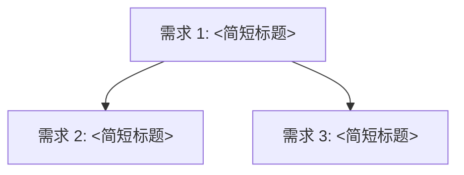

# 项目工程路线图模板

<!--
[约束说明]
1. 全篇 ≤ 100 行，措辞精简专业，严格按开发落地顺序展开
2. 观点必须严格溯源至工作意图、工作洞察与代码仓库
3. 统一使用 Mermaid 渲染依赖关系（节点文本强制使用双引号包裹，防止特殊字符解析失败）
-->

# <项目名> 项目工程路线图

> 更新日期：<YYYY-MM-DD> | 对应代码：`<代码路径/模块>` | 来源：`<意图文件>` + `<洞察文件>`  
> 注意：<补充工程上下文、版本兼容性或跨模块依赖说明>

## 需求 1：<需求简短标题>（<代码模块路径>）

### 问题
<描述当前工程现状，并指出导致的具体痛点与生产后果（现状 + 后果，严禁简单写“缺少某功能”）。>

### 目标
- <目标 1：模型与规范定义>
- <目标 2：数据流与接口打通>
- <目标 3：验收用例与测试标准>

### 技术方向
- **模型/规范**：<新增/修改的模型定义，遵循定义先于规则>
- **核心实现**：<具体接口/算法/存储层实现路径>
- **设计排除**：<本次明确不做的边界>

## 需求 2：<需求简短标题>（<代码模块路径>）

### 问题
<描述当前工程现状及痛点后果。>

### 目标
- <目标 1：模型与规范定义>
- <目标 2：数据流与接口打通>
- <目标 3：验收用例与测试标准>

### 技术方向
- **模型/规范**：<新增/修改的模型定义>
- **核心实现**：<具体接口/算法/存储层实现路径>
- **设计排除**：<本次明确不做的边界>

## 需求 3：<需求简短标题>（<代码模块路径>）

### 问题
<描述当前工程现状及痛点后果。>

### 目标
- <目标 1：模型与规范定义>
- <目标 2：数据流与接口打通>
- <目标 3：验收用例与测试标准>

### 技术方向
- **模型/规范**：<新增/修改的模型定义>
- **核心实现**：<具体接口/算法/存储层实现路径>
- **设计排除**：<本次明确不做的边界>

## 需求间依赖关系

<用一句话解释依赖推导逻辑（例如：需求 1 是数据底座，需求 2 和 3 分别承接消费端与执行端）。>

## 核心命令/接口集

| 命令 / 接口 | 操作对象 | 核心功能 |
|:---|:---|:---|
| `<cmd / API>` | `<操作目标>` | `<功能描述与角色>` |

## Feature 愿景

**<一句话核心交付口号/标语>**

- **v0.1**：<最小可运行验证形态>
- **v0.2+**：<完整链路闭环形态>
