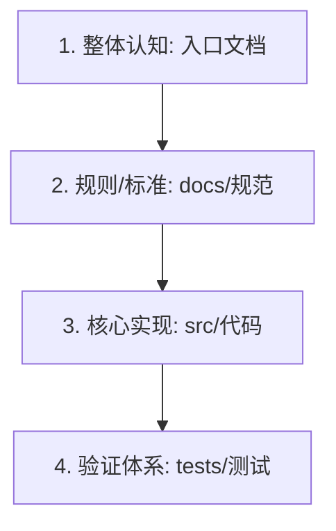

# 项目透视模板

<!--
[约束说明]
1. 全篇 ≤ 300 行，面向工程师/新人，重点文本加粗显示
2. 严禁保留任何 HTML 注释与占位说明；严禁直接照抄示例
3. 内容必须全部基于对目标仓库代码与文档的实际分析
-->

## 项目概述

**一句话定位**：<用一句话精准阐述本项目是什么、核心解决什么业务/技术痛点>。

## 知识结构

### 顶层目录树

```text
<项目根目录名>/
├── <核心目录1>/       ← <简明职责说明>
├── <核心目录2>/       ← <简明职责说明>
└── <核心入口文件>     ← <主入口说明>
```

### 关键文档

| 文档 | 角色定位 | 推荐阅读时机 |
|:---|:---|:---|
| `<文档路径1>` | `<文档角色>` | `<何时阅读>` |
| `<文档路径2>` | `<文档角色>` | `<何时阅读>` |

### 知识层级与阅读建议



- **知识层级说明**：<分层次阐述各目录如何逐层展开（如：产品定义 → 契约标准 → 核心代码 → 验证沙盒）>。
- **阅读顺序建议**：<按 1、2、3... 给出新人的渐进式探索路径>。

## 核心功能

### 1. <核心功能模块一>
- **业务职责**：<该模块处理的核心业务>
- **实现机制**：<核心组件协作关系、关键接口与数据流>

### 2. <核心功能模块二>
- **业务职责**：<该模块处理的核心业务>
- **实现机制**：<核心组件协作关系、关键接口与数据流>

## 最小工作流

### 前置依赖
- `<运行环境/工具链 1 及最低版本>`
- `<运行环境/工具链 2 及最低版本>`

### 核心命令序列

```bash
# 1. 依赖安装 / 构建
<build_command>

# 2. 本地自检 / 测试
<test_command>

# 3. 本地启动 / 日常开发
<run_command>
```

### 常用操作速查

| 场景 | 对应命令 | 说明 |
|:---|:---|:---|
| `<场景1>` | `<命令1>` | `<说明1>` |
| `<场景2>` | `<命令2>` | `<说明2>` |
