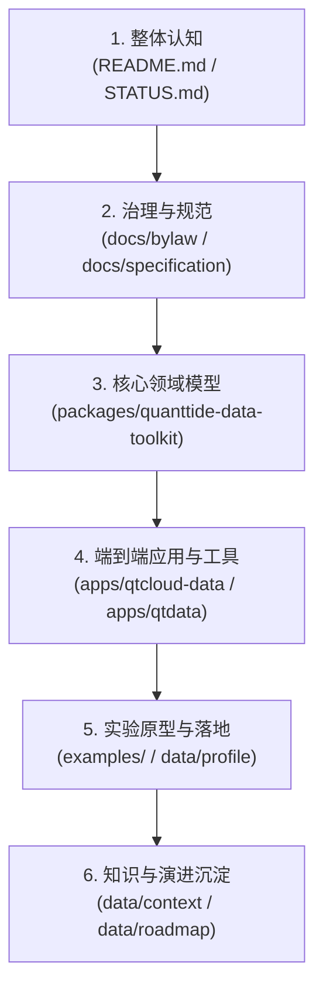

# quanttide-data 项目透视

## 项目概述

**一句话定位**：`quanttide-data` 是量潮第二大脑的数据工程领域聚合仓库，基于双九宫格 20 类标准资产与 Git 子模块架构，统一治理数据工程领域的数据资产（陈述性记忆）、规范文档（程序性记忆）、工具套件（Toolkit）及端到端应用（Apps）。

## 知识结构

### 顶层目录树

```text
quanttide-data/
├── apps/                  ← 端到端应用层（CLI 命令行、Provider 接口服务、Studio 桌面/Web 端）
│   ├── qtcloud-data/      ← 数据需求（DRD）与规格驱动的生命周期管理 CLI 与桌面端
│   └── qtdata/            ← 数据工程统一工具链（CLI + Provider + Studio）
├── packages/              ← 跨语言共享工具包与核心领域模型（Toolkit）
│   ├── quanttide-agent-toolkit/ ← 轻量级 AI Agent 与大模型调用工具包（Rust / Python）
│   ├── quanttide-data-toolkit/  ← 数据工程四层模型与 SDK（Rust / Python / Dart / Flutter）
│   └── quanttide-toolkit/       ← 跨领域通用基础工具包
├── docs/                  ← 程序性记忆（方法、标准与流程治理）
│   ├── bylaw/             ← 治理章程（回答“必须做什么”，流程要求与质量门禁）
│   ├── specification/     ← 核心规范（回答“长什么样”，DRD/Contract/Blueprint/Catalog/Pipeline）
│   ├── handbook/          ← 工程操作手册（采集、处理、标注、存储、交付与 DataOps）
│   ├── gallery/           ← 领域实践案例库
│   ├── tutorial/          ← 教程与概念引导
│   └── essay/             ← 深度技术随笔与架构思考
├── data/                  ← 陈述性记忆（知识沉淀、事实记录与演进历史）
│   ├── context/           ← 设计哲学、背景语境与决策推导
│   ├── profile/           ← 典型数据档案与样本剖析
│   ├── intention/         ← 阶段性工作意图与业务目标
│   ├── insight/           ← 深度架构洞察与经验提炼
│   ├── roadmap/           ← 演进路线图
│   ├── journal/           ← 按日期记录的工作会话与操作日志
│   ├── library/           ← 行业工具、竞品与外部参考资料
│   ├── report/            ← 质量度量与评估报告
│   ├── history/           ← 演进历史记录
│   ├── brochure/          ← 产品宣传手册与功能介绍
│   └── archive/           ← 历史废弃资产归档
├── examples/              ← 实验室与原型验证环境
│   ├── company/           ← 商业实体数据工程与分类器实验
│   └── default/           ← 基础管线原型与沙盒实验
├── .agents/               ← AI Agent 技能配置与自动化流程（DevOps、知识流水线等）
├── AGENTS.md              ← AI Agent 协作与子模块工作总指南
├── CONTRIBUTING.md        ← 分层提交流程与贡献指南
├── STATUS.md              ← 各子模块版本与 Commit 对齐报告
└── README.md              ← 仓库定位与架构导航
```

### 关键文档

| 文档 | 角色定位 | 推荐阅读时机 |
|:---|:---|:---|
| `README.md` | 仓库定位、全景架构与子模块导航 | 首次进入项目，建立全局认知时 |
| `CONTRIBUTING.md` | 分层提交流程、子模块更新规范与开发准则 | 准备修改代码或提交变更前 |
| `STATUS.md` | 记录 20+ 个子模块最新版本与 Commit 指针状态 | 检查环境同步情况、发版核验时 |
| `AGENTS.md` | AI 技能索引、子模块规则与特殊文件指引 | 启动 AI 编程助手、配置自动化流程时 |
| `docs/specification/index.md` | 四层架构规范总览（DRD/契约/蓝图/目录/管道） | 设计数据流、编写数据 Schema 或扩展模型时 |
| `docs/bylaw/index.md` | 治理规则、质量门禁与跨领域流转准则 | 涉及流程变动、架构合规性评审时 |

### 知识层级与阅读建议



- **知识层级说明**：从宏观治理准则（`docs/`）出发，自顶向下约束核心模型与 SDK（`packages/`），进而驱动具体应用实现（`apps/`），并在实验室沙盒（`examples/`）和真实数据档案（`data/profile`）中验证，最终将决策与洞察沉淀回陈述性记忆库（`data/`）。
- **阅读顺序建议**：
  1. 先读根目录 `README.md` 与 `STATUS.md` 建立多仓库架构认知；
  2. 阅读 `docs/specification/index.md` 与 `docs/bylaw/index.md` 掌握四层数据架构与设计约束；
  3. 研读 `packages/quanttide-data-toolkit` 了解 Rust / Dart / Python 的类型建模实现；
  4. 查阅 `apps/qtcloud-data` 与 `apps/qtdata` 查看 CLI 与前端应用的工作机制；
  5. 查阅 `data/context` 与 `data/roadmap` 掌握历史演进脉络与未来方向。

## 核心功能

### 1. 四层数据工程规范与治理体系 (Specification & Bylaw)
- **业务职责**：定义数据从需求提出到最终交付的全生命周期标准（需求层 DRD → 规格层 Contract / Blueprint → 实现层 Catalog / Pipeline → 交付层 Delivery），同时通过章程设立流程合规与质量门禁。
- **实现机制**：`docs/specification` 以 Unix 风格定义元数据结构与 YAML/JSON 规范；`docs/bylaw` 规定规则与约束；各语言 SDK 与 CLI 工具链直接消费这些规范作为事实源。

### 2. 跨语言领域建模与全栈工具链 (Toolkit & Apps)
- **业务职责**：提供从本地 CLI 处理、服务端 API 调度到 Flutter 桌面/移动端可视化探索的全套工程落地能力。
- **实现机制**：`packages/quanttide-data-toolkit` 分别在 Rust、Python、Dart 中提供强类型契约解析器；`apps/qtcloud-data` 驱动数据生命周期各阶段流水线；`apps/qtdata` 提供前后端一体化的数据作业管理。

### 3. 第二大脑知识生产与自动化演进 (Knowledge Pipeline & Agents)
- **业务职责**：将开发过程中的日志、提交、碎片语境自动化加工为结构化知识资产，驱动技术与业务闭环。
- **实现机制**：通过 `.agents/skills/`（如 `knowledge-pipeline`、`qtcloud-devops`）沉淀工作流，联动 `data/` 下 11 类陈述性资产，实现意图识别、架构洞察与路线图自动化迭代。

## 最小工作流

### 前置依赖
- Git（≥ 2.20）
- Python（≥ 3.10，推荐使用 `uv` 管理）
- Rust（`cargo` 最新稳定版）
- Dart / Flutter SDK（用于开发 Studio 客户端及 Dart 模型包）

### 核心命令序列

```bash
# 1. 克隆仓库并递归拉取所有子模块
git clone --recurse-submodules https://github.com/quanttide/quanttide-data.git
cd quanttide-data

# 2. 依赖检查与子模块状态同步
git submodule update --init --recursive
git status

# 3. 运行核心工具包测试（以 Rust 与 Python 为例）
cargo test --manifest-path packages/quanttide-data-toolkit/packages/rust/Cargo.toml
uv run pytest packages/quanttide-data-toolkit/packages/python/tests
```

### 常用操作速查

| 场景 | 对应命令 | 说明 |
|:---|:---|:---|
| 更新所有子模块引用 | `git submodule update --remote` | 拉取所有子模块最新远程提交 |
| 子模块分层提交 | `cd <submodule_path> && git commit -m "..." && git push && cd .. && git commit <submodule_path> -m "update <submodule>: ..."` | 严格遵守先提交子模块、再在根仓更新指针的规范 |
| 运行 DevOps CLI 检查 | `qtcloud-devops status` 或 `cargo run --manifest-path apps/qtcloud-data/src/cli/Cargo.toml` | 检查各子模块及流水线当前状态 |
| 启动数据工程前端 | `cd apps/qtdata/src/studio && flutter run -d windows` (或 linux/macos) | 本地调试运行 Studio 桌面端 |
